# Microbial Reference Genomes, Variant Calling, and Multiple Genome Alignment

<details>
 <summary>
  
 ## Session Summary</summary>
 <p></p>

 * Kick-off (Todd)
   
 * Fantastic reference genomes and where to find them (hands on: Mike, Natalie)
 
   * RefSeq
       
   * GenBank
  
   * SRA
     
* Bespoke Strain-level analyses (lecture: Mike)

   * Core Genome Alignment

   * Whole Genome Alignment
     
* Multiple Genome Alignment (hands on: Mike, Natalie)

   * Running Parsnp 
 
   * Visualization with Gingr
     
* Mapping reads to reference genomes for variant calling (lecture: Daniel)

   * Short-reads

   * Long-reads
     
   * SNVs
     
   * SVs
  
</details>

 <details>
 <summary> 
  
## Fantastic reference genomes and where to find them (lecture + hands-on) </summary>
* NCBI
  * SRA 		 _[https://www\.ncbi\.nlm\.nih\.gov/sra](https://www.ncbi.nlm.nih.gov/sra)_
  * Taxonomy		 _[https://www\.ncbi\.nlm\.nih\.gov/taxonomy](https://www.ncbi.nlm.nih.gov/taxonomy)_
  * RefSeq		 _[https://www\.ncbi\.nlm\.nih\.gov/refseq/](https://www.ncbi.nlm.nih.gov/refseq/)_
* GISAID
  * EpiCoV		 _[https://www\.gisaid\.org/](https://www.gisaid.org/)_
* Internal Sources
* Other Sources

### National Center for Biotechnology Information (NCBI)

_[https://www\.ncbi\.nlm\.nih\.gov/](https://www.ncbi.nlm.nih.gov/)_


__Sequence of the reference genome in fasta format__

__Gene annotation file in GFF3 format__

__Comprehensive record of the sequence including annotations in genbank format__


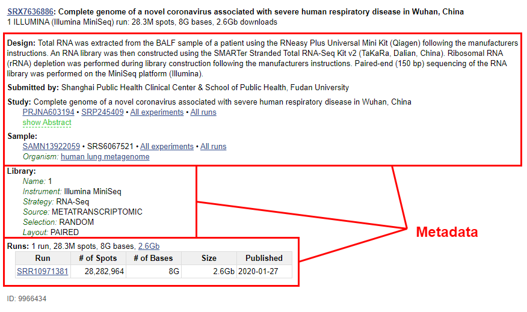

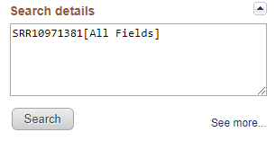

<span style="color:#FF0000"> __Formatted search string__ </span>


### SARS-CoV-2 sequences currently available in GenBank and the Sequence Read Archive (SRA)

Until Wed May 27 14:55:29 EDT 2020

4\,735 GenBank sequences

1 RefSeq sequence

6\,486 SRA Sequences

_[https://www\.ncbi\.nlm\.nih\.gov/genbank/sars\-cov\-2\-seqs/](https://www.ncbi.nlm.nih.gov/genbank/sars-cov-2-seqs/)_


### NCBI Advance Search Builder


Refine your search by using Boolean operations

Useful search terms including accession id\, bio project\, organism\, layout \(single vs paired\)\, publication date\, source \(WGS\, Amplicon\, metatranscriptomic\, etc\.\)\, platform \(Illumina vs Nanopore\)\, etc\.

Generating search string that can be used in Entrez API

### Entrez Databases and Retrieval System

Available via  _[http://www\.ncbi\.nlm\.nih\.gov/Entrez/](http://www.ncbi.nlm.nih.gov/Entrez/)_

A part of Biopython package  _[http://biopython\.org/DIST/docs/tutorial/Tutorial\.html](http://biopython.org/DIST/docs/tutorial/Tutorial.html)_

Entrez Programming Utilities Help  _[https://www\.ncbi\.nlm\.nih\.gov/books/NBK25501/](https://www.ncbi.nlm.nih.gov/books/NBK25501/)_

Always tell NCBI who you are by setting  _Entrez\.email _ parameter

NCBI Entrez API allows advanced searches of records in multiple NCBI database as well as retrieving metadata for the records

3 requests per second without an API key\, or 10 requests per second with an API key \(registered account strongly recommended\)

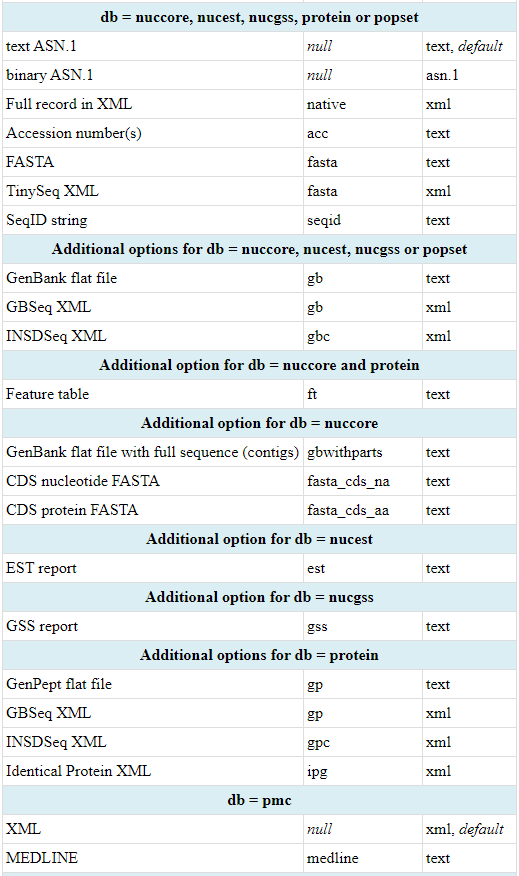


### SRA Toolkit

* Entrez package can be used to retrieve small files
* SRA Toolkit is required to download large read datasets  _[https://trace\.ncbi\.nlm\.nih\.gov/Traces/sra/sra\.cgi?view=software](https://trace.ncbi.nlm.nih.gov/Traces/sra/sra.cgi?view=software)_
  * prefetch
    * prefetch \[options\] \<SRA accession>
  * fastq\-dump
    * fastq\-dump \[options\] \< accession >
  * \-\-split\-3 flag or \-\-split\-files must be set\, split spots into individual reads\. With \-\-split\-3 flag\, output would be 1\,2\, or 3 files\.
    * 1 file means the data is not paired\.
    * 2 file means the reads are paired\-end reads\.
    * 3rd file\, often small\, contains unpaired orphaned reads\, typically ignored\.

</details>


 <details>
 <summary>
  
## Bespoke Strain-Level Analysis of Bacterial Genomes (lecture)
 
</summary>

## Michael Nute

RAD Microbes 2023
December 14th, 2023

### Whole-Genome Alignment

Idea: align specifically the  _shared \(“core”\)_  portion of several genomes\.

Use these aligned segments to identify phylogenetic relationships\, etc…

Visualize what exactly is similar and different…

_Tools:_

Parsnp

Mauve

SibeliaZ

\(others…\)

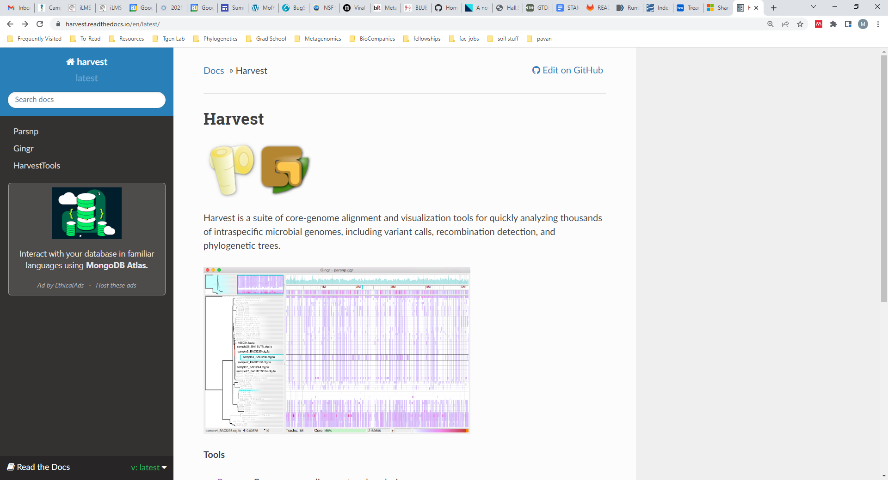

#### Whole Genome Alignment: Quick How-To with Parsnp

* Get  _assembled_  genomes from individual organisms
  * Isolates are nice\, MAGs will do
  * Contigs are fine for this\, doesn’t have to be complete
  * Helps to have at least 1 high\-quality\, annotated reference genome
  * Useful to run QUAST to QC the assembly
* Run Parsnp:

  * contig\_repo=\./parsnp\_contigs
  * parsnp\_out=\./parsnp\_output\_13
  * ref\_genbank=\./ref\_assembly\_GCF\_008121495/Ref\_ATCC\_29149\.gbff
  * parsnp \-g $ref\_genbank \-d $contig\_repo \-p 15 \-o $parsnp\_out

_Annotated Reference Genome \(\._  _gbff_  _ format\)_

_Folder with 1 _  _fasta_  _ file for each assembly \(containing all contigs\)_

__What can we learn?__

Assembly Quality Issues?

Issues with Reference?

### Interlude: QC-ing an Assembly with QUAST

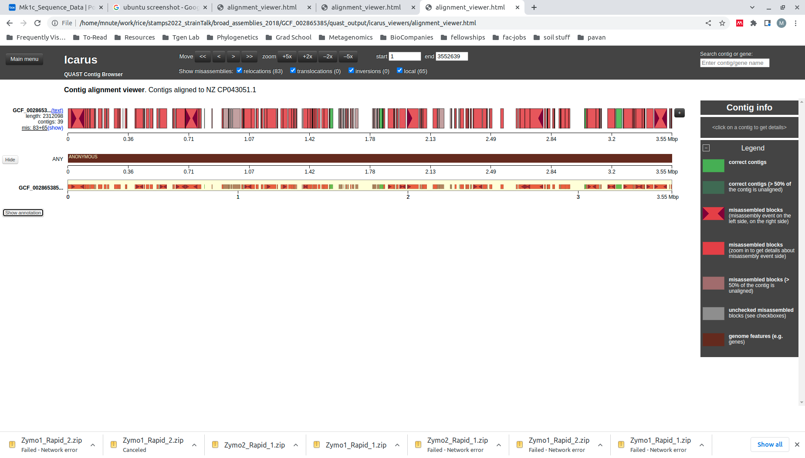

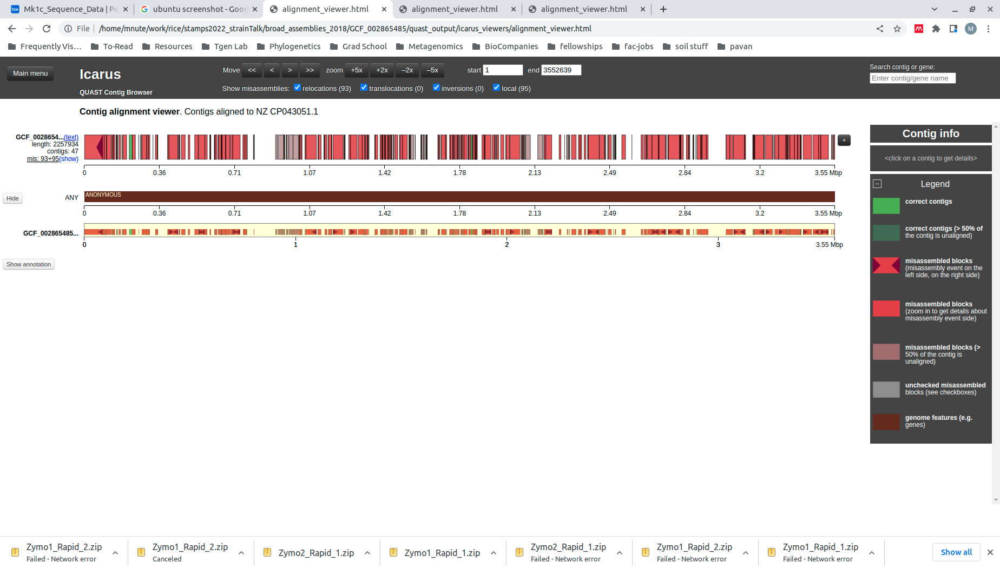

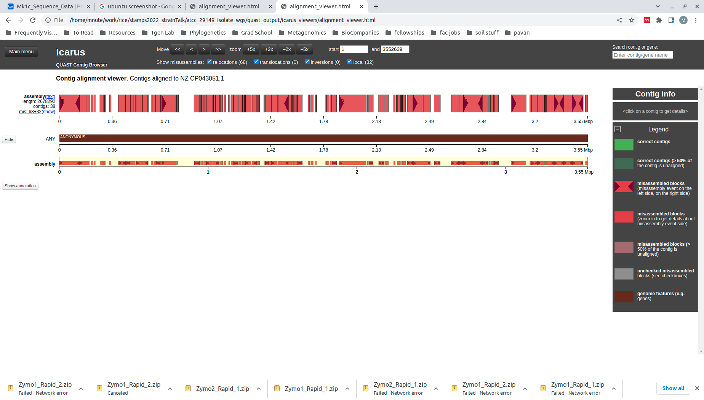

### Case-Study: C. difficile Genomes

Gingr Data Visualization:

Color = % mutation compared to reference

_RT078 – Originated in animal host\, crossed over_

_RT027 – Known hypervirulent strain\. More recurrent\, nastier patient outcomes\._

WGA of 720 assembled C\. difficile genomes

Spot the strains…

### Case-Study: C. difficile Genomes (excluding RT078 samples)

### Subset of Genomes w/ST annotation


__Q__ : What makes RT027 different?

__A__ : Pockets of heavy mutation

#### Digging Deeper…

_This particular region is precisely the coding locus for Toxin B\. _

_RT027 carries a variant _  _tcdB_  _ gene with altered function that contributes to its virulence\._

_Note_  _: not all of the _  _tcdB_  _ gene was aligned by Parsnp\, so this table represents the aligned length \(5\,103bp\) vs total \(7\,101bp\)\._

_Gene: _  _tcdB_  _ \(toxin B\)_

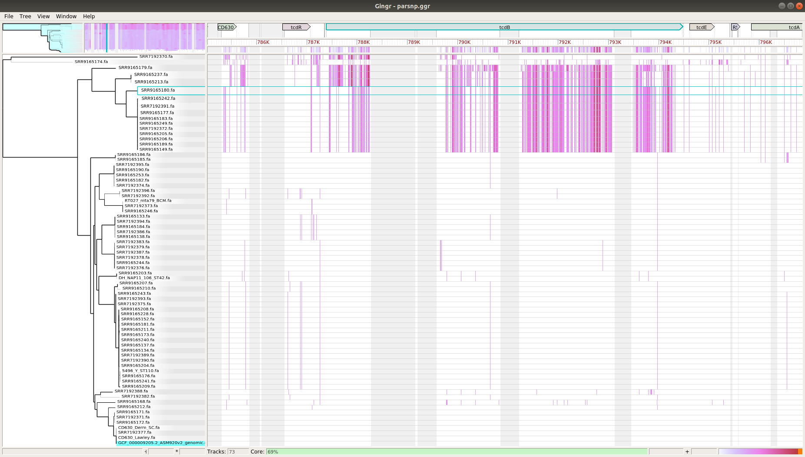


#### Comparing Reference Genomes for Some Strains

_Note_  _: RT027 is in the top row\. CD630 is a lab strain used as a common reference\._


__Segment 1 __

\(positions 0\-2mbp\)


__Segment 2 __

\(positions 2\-4mbp\)

_Here the mutation pockets are much clearer\._

#### Digging Deeper Again…

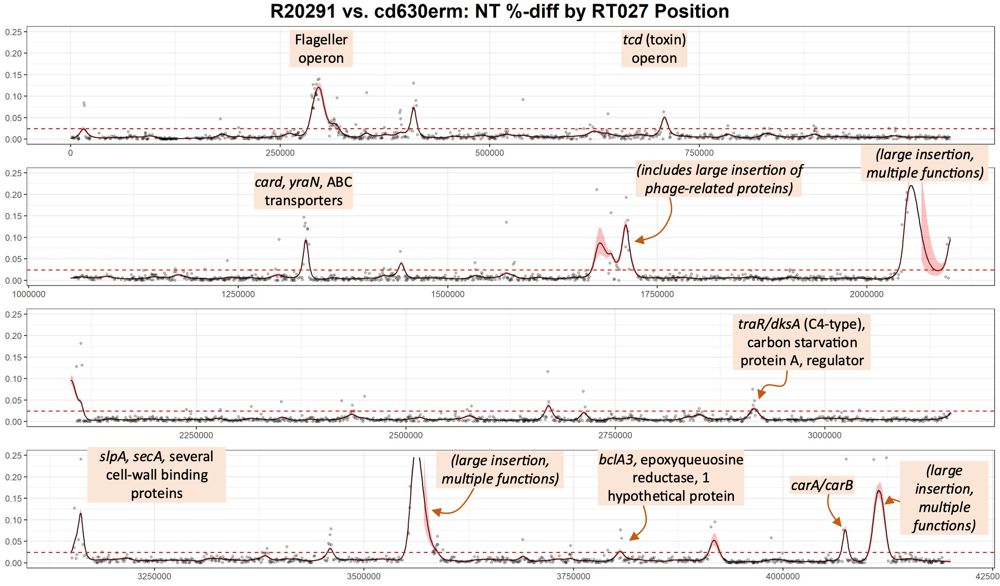

### Comparing Location of Homologous Genes

* Scatter Plot
  * Each point shows position in genome for CD630 & RT027\, for a single shared gene
  * Color indicates %\-AA\-similarity
* Despite differences\, genomes are highly colinear
  * Many short indels throughout
  * No major rearrangements except a few small segments\.
  * Small rearrangements coincide with locations of high\-mutation


_For C\. diff\, even across a huge number of isolates\, very little rearrangement shows up \(outliers here are reference genomes with single contig\, likely a different starting point _  _on the circular genome\._  _\)_

### Synteny Comparison: C. difficile Isolates

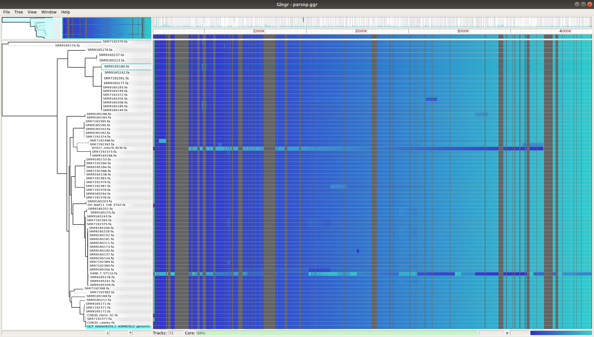

### Alignment of RT027 isolates (and near relatives) to RT027 ref.

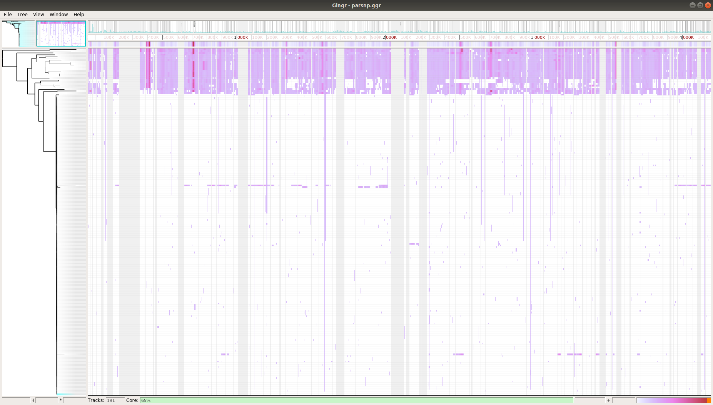

_Does the RT027 Reference match the genomes from the clinic?_

_…Yes_

_Very little to see\, very high match level with all RT027 isolates except 3\. _

### Another Case Study: R. gnavus Isolates from IBD Patients

__14 Genomes:__

Reference: ATCC 29149 \(RefSeq GCF\_008121495\)

ATCC 29149  _de novo _ assembly \(by me\)

ATCC 35913 \(GenBank GCA\_900036035\)

12 Genomes from Hall et al\. \(2017\) \(table at right\)


_Game 2 : Spot the 2_  _nd_  _ ATCC 29149 gnome \(supposedly the same as the reference\)_

_Game 1 : Spot the 2 Genomes from Infant Stool \(non\-IBD\)_


### R. gnavus strain-level phylogenetic signal is a mess


_These two organisms have very different types of genome plasticity\._

### Synteny Comparison: R. gnavus & C. difficile


## Conclusions

* _Special Thanks To:_
* The Treangen Lab \(Rice\)
  * Todd Treangen
  * Bryce Killie
  * Kristen Curry
  * Nick Sapoval
  * Yunxi Liu
  * Yilei Fu
  * Advait Balaji
* The Savidge Lab \(Baylor College of Medicine\)
  * Qinglong Wu
  * Charlie Seto
* Taylor Reiter \(for the  _R\. _  _gnavus_  idea\)

* Whole\-genome alignment will give a detailed comparison specifically of the  _core_  genome
  * Maybe also auxiliary genes \( _pan_ \-genome\)
* Visualization can get you up close and personal with the data
  * \(This statement applies to almost everything\, not just genomes\)
* Strains can differ from one another in weird ways\.
  * Selective mutation at points of interest
  * Gene gain/loss depending on environment
  * Genome\-wide phylogenetic signal vs\. Locus\-specific signal
  * Etc…?

# Appendix: Quick How-to with Gingr (1 of 2)

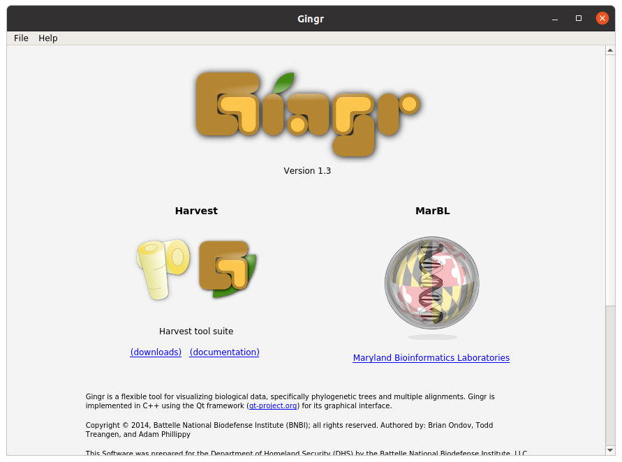

_1\.\) Open the \*\._  _ggr_  _ file created in the _  _parsnp_  _ output folder\._

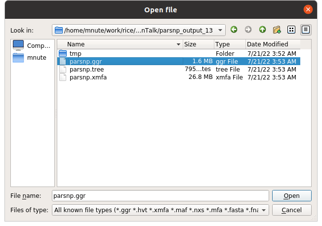

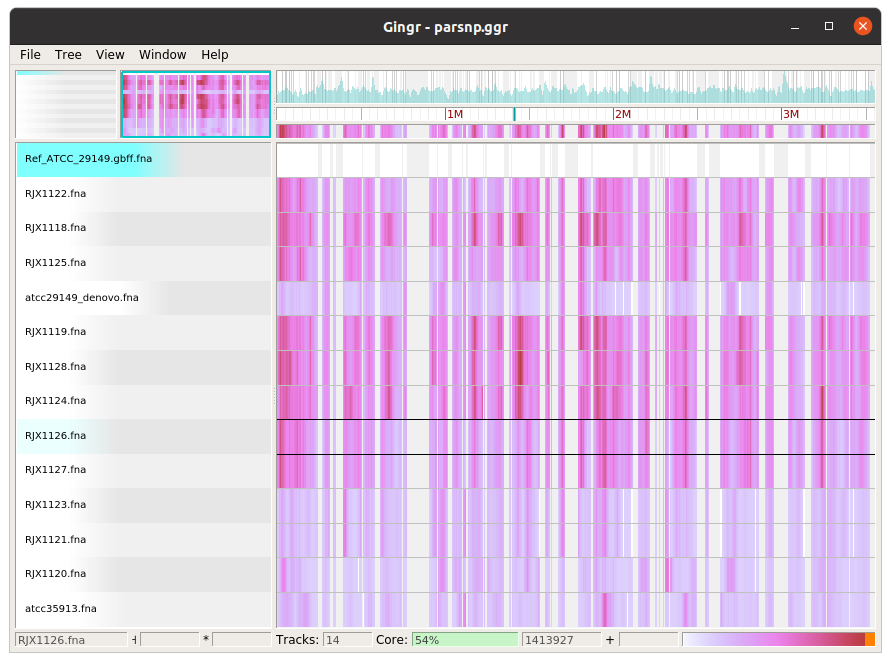

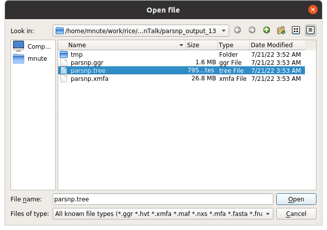

_2\.\) Once it is open\, go back to the “Open” dialogue and open the \*\.tree file in the same folder\._

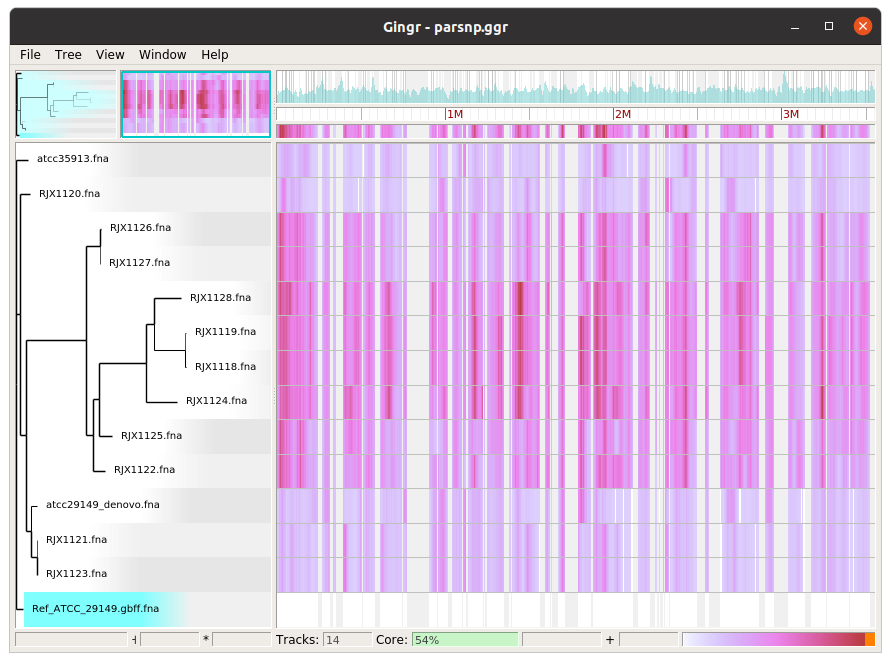

_3\.\) This will give you the standard _  _Gingr_  _ view\. Other options to re\-root the tree or to switch to Synteny view are available under the “Tree” and “View” menus\._

</details>

<details>
 <summary>
  
 ## Multiple Genome Alignment (hands-on) </summary>
 <p></p>
========

This tutorial is to go over how to use Parsnp for multiple genome alignment (core). The first dataset is a MERS coronavirus outbreak dataset involving 49 isolates. The second dataset is a selected set of 31 Streptococcus pneumoniae genomes. For reference, both of these datasets should run on modestly equipped laptops in a few minutes or less.

## <a name ="first">Installation</a> 

Have ParSNP installed. Parsnpcan be run on macOS / linux  

1)Download & install Parsnp on MacOS

   `wget https://github.com/marbl/parsnp/releases/download/v1.2/parsnp-OSX64-v1.2.tar.gz`  
   
   `tar -xvf parsnp-OSX64-v1.2.tar.gz`
  
2)Download & install Parsnp on Linux

   `wget https://github.com/marbl/parsnp/releases/download/v1.2/parsnp-Linux64-v1.2.tar.gz`   
   
   `tar -xvf parsnp-Linux64-v1.2.tar.gz`  


**From CONDA**  

ParSNP is available on the bioconda channel.   
To install: 
`conda install parsnp
`

****


**To install Gingr**,   
(Interactive visualization of alignments, trees and variants)  
*For MacOS:   

[gingr-OSX64-v1.3.zip](https://github.com/marbl/gingr/releases/download/v1.3/gingr-OSX64-v1.3.app.zip)  

*For Linux:    

[gingr-Linux64-v1.3.tar.gz](https://github.com/marbl/gingr/releases/download/v1.3/gingr-Linux64-v1.3.tar.gz/)  
   

   1) <a name="part3e1">Example 1: 49 MERS Coronavirus genomes </a>
   
      * Download genomes: 
         * `mkdir parsnp_demo1`
         * `cd parsnp_demo1`
         * `wget https://github.com/marbl/harvest/raw/master/docs/content/parsnp/mers49.tar.gz` [download](https://github.com/marbl/harvest/raw/master/docs/content/parsnp/mers49.tar.gz)
         * `tar -xvf mers49.tar.gz`
    
      * Run parsnp with default parameters 
      
         parsnp -r ./mers49/England1.fna -d ./mers49 -c
         
      * Command-line output 

        

      * Visualize with Gingr [download](https://github.com/marbl/harvest/raw/master/docs/content/parsnp/run_mers.gingr1.ggr)
      
        

      * Configure parameters
      
         - 95% of the reference is covered by the alignment. This is <100% mainly due to a 1kbp unaligned region from 26kbp to 27kbp.
         - To force alignment across large collinear regions, use the `-C` maximum distance between two collinear MUMs::
         
            ./parsnp -r ./mers49/England1.fna -d ./mers49 -C 2000 -c
            
      * Visualize again with Gingr :download:`GGR <run_mers.gingr2.ggr>`
      
         - By adjusting the `-C` parameter, this region is no longer unaligned, boosting the reference coverage to 97%.

        
        
      * Zoom in with Gingr for nucleotide view of region
      
         - On closer inspection, a large stretch of N's in Jeddah isolate C7569 was the culprit
         
        
         
      * Inspect Output:
      
         * Multiple alignment: :download:`XMFA <runm1.xmfa>` 
         * SNPs: :download:`VCF <runm1.vcf>`
         * Phylogeny: :download:`Newick <runm1.tree>`
 
   2) <a name="part3e2">Example 2: 31 Streptococcus pneumoniae genomes </a>
   
     --Download genomes:
   * `cd $HOME`
   * `mkdir parsnp_demo2`
   * `cd parsnp_demo2`
   *  `wget https://github.com/marbl/harvest/raw/master/docs/content/parsnp/strep31.tar.gz`
   *  `tar -xvf strep31.tar.gz`
    
     --Run parsnp:
      
    parsnp -r ./strep31/NC_011900.fna -d ./strep31 -p 8

     --Force inclusion of all genomes (-c):
      
    parsnp -r ./strep31/NC_011900.fna -d ./strep31 -p 8 -c

     --Enable recombination detection/filter (-x):
      
    parsnp -r ./strep31/NC_011900.fna -d ./strep31 -p 8 -c -x

     --Inspect Output:
      
         * Multiple alignment: parsnp.xmfa
         * Phylogeny: parsnp.tree


This last step requires you to download software and is to highlight the ability to inspect strain-level differences within genomes assembled from metagenomic samples.

1) Use AliView 

    * Download AliView:

    [https://ormbunkar.se/aliview/downloads/)

    * Download MFA file:

    wget https://obj.umiacs.umd.edu/stamps2019/aliview.input.mfa

    * Open AliView
      
    * Load MFA file:

    File->Open File

</details>

<details>
 <summary>
  
 ## Mapping reads to reference genomes for variant calling (lecture, Daniel) </summary>
# Alignment and quality control (QC) of aligning short-read data

## Mapping reads

### 1. Index reference genome:
We first need to index the reference genome itself by using `bwa index`.

```
bwa index reference.fasta
```
This should only take a few seconds since the SARS-Cov-2 genome is tiny.

### 2. Map reads to genome:
Next we are ready to start mapping the fastq reads to the genome itself. For this we want to use the `bwa mem` option that is best capable to handle the Illumina paired end reads.

```
 bwa mem -t 2 reference.fasta  raw_reads.fastq.gz  raw_reads.fastq.gz > our_mapped_reads.sam
```

This executes bwa mem with `2` threads (`-t` parameter) give our previously indexed `reference.fasta` and the two fastq files representing the Illumina paired end reads.

After some time the program ends and we have our first result as : `our_mapped_reads.sam`. This is a standard text file (see SAM file format specification [here](https://samtools.github.io/hts-specs/SAMv1.pdf)) and we can take a look.Here we have a header in this file indicated with `@` and then entries per read per line.

### 3. Converting a SAM file to a BAM file

For subsequent analysis we need to compress (SAM -> BAM) the file. For this we are using [samtools](https://github.com/samtools/samtools) with the option: `view`

```
samtools view -hb our_mapped_reads.sam > our_mapped_reads.bam
```

The options `-h` ensures that the header is kept for the output file and the option `-b` tells `samtools` that we want to obtain the compressed (BAM) version.


### 4. Sorting a BAM file

Next we need to sort the file according to read mapping locations. For this we again are using `samtools`, but this time the `sort` option.

```
samtools sort our_mapped_reads.bam > our_mapped_reads.sort.bam
```
The output file `our_mapped_reads.sort.bam` is now a sorted and mapped read file that is necessary for subsequent analysis. Keep in mind that this file includes the same information as the previous files, but nowsorted.

You can see based on the file sizes that the compression and sorting significantly reduced the file size:
```
ll -h our_mapped_reads.*
```

This should show you that the sam file (`our_mapped_reads.sam`) is the largest file and the compressed and sorted bam file (`our_mapped_reads.sort.bam`) is actually the smallest file.

Since these files contain all the same information we don't need to keep the larger files anymore. To remove them from your disk we run:

```
rm our_mapped_reads.bam
rm our_mapped_reads.sam
```


### 5. Creating a BAM index file

The last step that is necessary for a subsequent analysis is to index the sorted and compressed read file:
```
samtools index our_mapped_reads.sort.bam
```

Thus in the end you should have 2 files: `our_mapped_reads.sort.bam` and `our_mapped_reads.sort.bam.bai`. The latter is the index file.

## Mapping QC

Before we move on to the variant analysis we want to inspect the mapped read file a little to see if all steps worked as expected.

First we want to count the mapped and unmapped reads. This can be  done using `samtools view`. For this we need to query / filter the reads based on their sam tag. You can here refresh what each tag stands for: https://broadinstitute.github.io/picard/explain-flags.html

To compute the number of mapped reads we run:

```
samtools view -c -F 4 our_mapped_reads.sort.bam
```
 The parameter `-c` tells samtools view, to only count and report that number to you. The parameter `-F 4` tells it to only use reads that are in disagreement with the flag:4 . You can see based on the above [URL](https://broadinstitute.github.io/picard/explain-flags.html) that this flag represents unmapped reads. Thus we are querying not unmapped reads, which is the count of mapped reads.

Often we want to further filter by using a certain mapping quality threshold. This can be done like this:

```
 samtools view -q 20 -c -F 4 our_mapped_reads.sort.bam
```
Here the addition of `-q 20` restricts the reads to have mapping quality of 20 or more that is typically indicative of highly trustful alignments.
Next we want to compute the number of unmapped reads:

```
 samtools view -c -f 4 our_mapped_reads.sort.bam
 ```
 Note we only need to change the `-F` to a `-f` to query for the Tag: 4.

 Using samtools view we can also do other manipulations/queries. For example we can query the reads that are split reads, but only the supplement splits. These reads are going to be useful later for the detection of SV.

 ```
samtools view -c -f 2048  our_mapped_reads.sort.bam
 ```
 Again feel free to check out what the tag 2048 means over at  https://broadinstitute.github.io/picard/explain-flags.html


 Lastly we can also compute the reads that are mapped on the `+` vs. `-` strand. For some type of analysis, this is an important metric:
 ```
 samtools view -c -q 20 -f 16  our_mapped_reads.sort.bam
 samtools view -c -q 20 -f 0  our_mapped_reads.sort.bam
```
This time the `-f 16` filters for reads on the `-` strand and the `-f 0` for reads that mapped to the `+` strand.

***

# Variant calling
Now that we have confidence in our mapped reads file and we know that it's the right format and reads are sorted, we can continue with the variant calling. First, we will call variants for SNV and subsequently for SV.  
There are many tools that can be used 
## SNV calling
For SNV calling we are going to use [FreeBayes](https://github.com/freebayes/freebayes).

Given our mapped read file and our reference fasta file we can execute Lofreq as follow:

```
freebayes -F 0.75 -! 5 -p 1 --min-mapping-quality 30 -f reference.fasta our_mapped_reads.sort.bam > our_snv.vcf 
```

This command presents different flags.  `-F` specifies the minimum fraction of alternate allele observations to consider variant sites. `-!` specifies the minimum coverage required to call variants. In this case, we need a minimum of 5 reads supporting the variant for it to be considered. `-p` defines the ploidy of the organism being evaluated. Some microorganisms, like the yeasts *C. albicans* and *S. cerevisiae* and other Eukaryotes are diploids, so you should adjust the this option to "2".  `--min-mapping-quality` specifies a mapping quality requirement of 30. `-f` defines the reference file.


In the end the program `FreeBayes` has produced a VCF file as its output: `our_snv.vcf` as defined by the `-o` option. We can open and inspect this file like:

```
less -S our_snv.vcf
```
Note to terminate this process press `q` to close less.
As we can see the VCF file follows a certain standard as it has first specified meta information as part of the header (`#`). This is then followed by each line showing a single variant.

Take your time to look into this file. Some of the important tags that are defined are `AF` (allele frequency within the sample), `DP4` list of supporting reads for reference and alternative split up over `+/-` strand. What is important to note is that each of these tags have to be defined in the header. Go and look up: `DP` and compare it to `DP4`.

To get a feeling about our file we want to query it a little to summarize our SNV calls.
First we want to count the total number of SNV in this file:
```
grep -vc '#' our_snv.vcf
```
This will count the number of lines that don't have an `#` in it. `-v` is inverting the match and `-c` is counting the number of these matches.

If we want to know if there is an imbalance in the nucleotides that has been changed we could use something simple like this:
```
grep -v '#' our_snv.vcf | cut -f 5 |sort | uniq -c
```
Again we are selecting against the header (`-v '#'`), then extracting column 5 (the alternative nucleotide) and sorting and counting the occurrence of each nucleotide (uniq ) with the `-c` option to count. You should see a clear preference for an `T` and `A` nucleotide that has been inserted.

We can also roughly and quickly see if there are hotspots for SNV along the genome:
```
grep -v '#' our_snv.vcf | cut -f 2 | awk '{print int($1/100)*100}'  | sort | uniq -c  | awk '$1 > 5 {print $0 }' | sort -n -k 2,2 | less
```
Here we extract similar to before the 2nd column (SNV position) and bin it by 100bp. Next we sort and count the occurrences and filter to have only regions that have more than 5 SNV within their 100bp. Lastly we make sure that the positions of the bins are sorted in the output.

A set of very useful methods are [bcftools](http://samtools.github.io/bcftools/) and [vcftools](https://vcftools.github.io/man_latest.html) to further filter and manipulate these files.

## SV calling
Detecting structural variants (SVs) using short-read sequencing data involves several methods, each with its own strengths and limitations. Here are some common methods used to call SVs from short-read data:

Read-pair (or paired-end) mapping: Utilizes information from paired-end reads where the expected distance between two reads mapped to the reference genome differs due to an SV. 

Split-read mapping: Identifies SVs by identifying reads that align partially to different locations due to breakpoints. Tools like Pindel and SPLITREADER utilize this approach.

Assembly-based methods: Assemble reads into longer contiguous sequences (contigs) and align them back to the reference genome to identify structural differences. Tools like TIGRA-SV and SOAPdenovo can be used for de novo assembly.

Depth of coverage analysis: Detects copy number variations (CNVs) by analyzing variations in read depth across the genome. Tools such as CNVnator and Control-FREEC rely on this method.

Hybrid methods: Combine multiple approaches, such as read-pair and split-read mapping or local assembly followed by read alignment, to improve accuracy and sensitivity. Sniffles, Lumpy and Manta are examples of tools using hybrid approaches.

Here, we will adopt Manta to demonstrate how to detect SVs using short reads. 

In the end we want to also identify Structural Variations (SVs). Here we are simply using [Manta](https://github.com/Illumina/manta), which was mainly designed to identify SV across a human genome. It works with almost any organisms however. This tool uses a combination of split reads and paired end approaches to detect SVs.


Manta requires two steps:

### 1. Initiate the run:
```
configManta.py --bam=our_mapped_reads.sort.bam --referenceFasta=reference.fasta --runDir=Out_Manta
```
This should initiate the folder structure and specifies for the subsequent process to use our mapped reads and our reference file. In addition, we specify the output to be written in `Out_Manta`

### 2. Run the analysis:
```
python Out_Manta/runWorkflow.py -j 2 -m local -g 10
```

This will launch the Manta pipeline that we previously configured. `-j` specifies the number of CPU threads (2 in our case), `-m` local indicates that it should not try to run things on different nodes or instances and `-g 30` specifies the available memory for the process in GB.

Manta now searches for abnormal paired-end reads and split-reads across our mapped reads. These will be analyzed together and clustered to identify SV in these samples. After some time, you should see that the program has finished.

Our SV calling results can be found here (Out_Manta/results/variants/). Let us open quickly the output of the highest quality SV files:
```
cd  Out_Manta/results/variants/
ls 
```
As you can see we have multiple VCF files. These represent the different stages of Manta and the confidence level for the SV calls. See more information about the Manta output [here](https://github.com/Illumina/manta). 
 
 <p></p>
 

